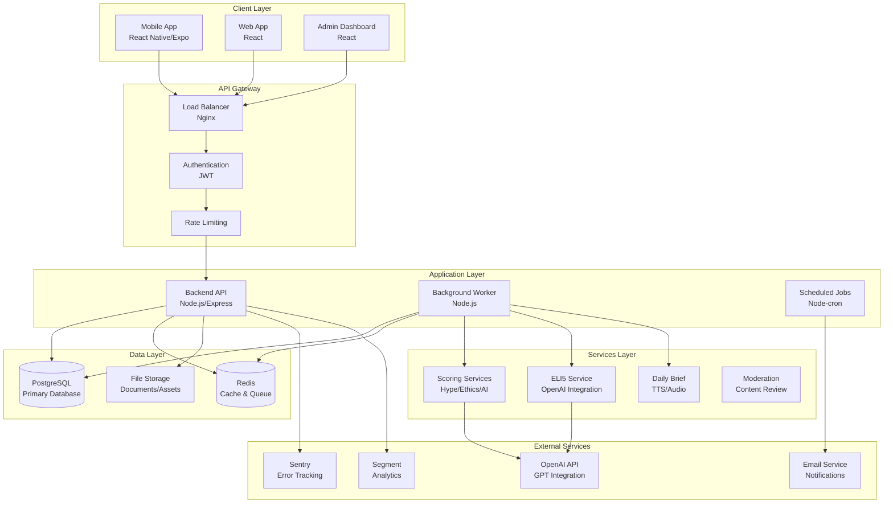
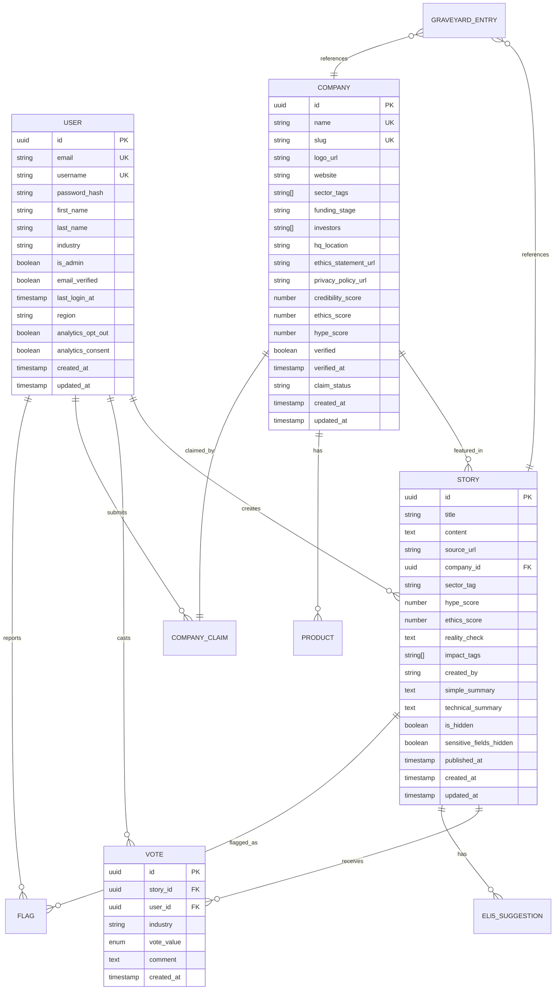
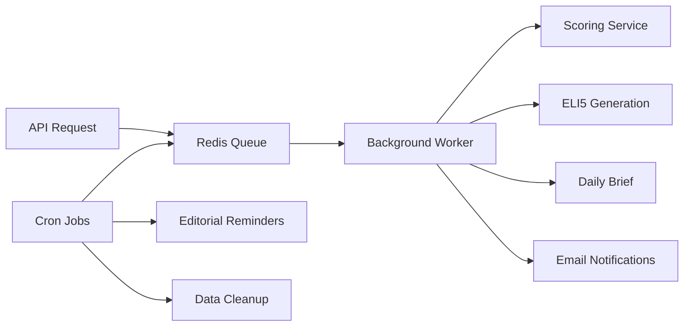
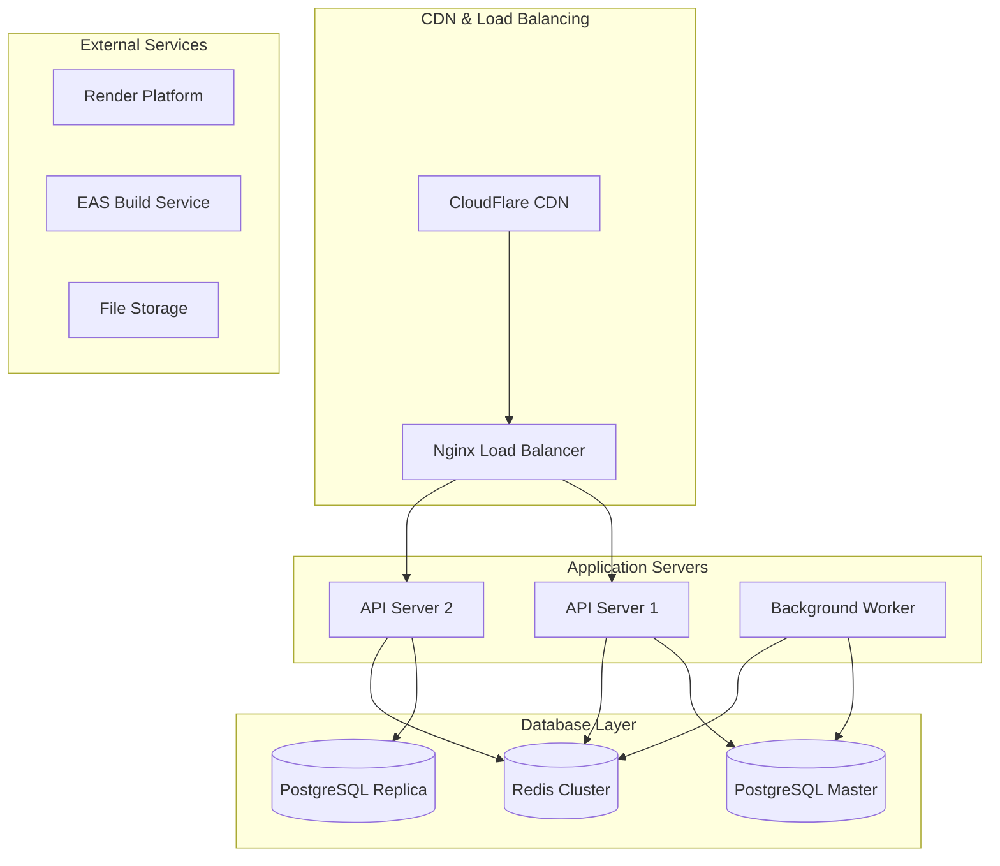

# TexhPulze Documentation

Welcome to TexhPulze - The World's First Technology Grievance Platform. This documentation provides a comprehensive overview of the platform's architecture, features, and implementation.

## 🎯 Overview

TexhPulze is a comprehensive platform that addresses technology ethics and transparency by providing:

- **Story Tracking**: Monitor technology announcements and their outcomes
- **Company Profiles**: Verify and track technology companies
- **Community Voting**: Crowdsourced assessment of technology impact
- **AI-Powered Analysis**: Automated scoring and reality checks
- **Mobile-First Experience**: Native mobile app for seamless access

## 🏗️ Architecture

### System Architecture Diagram



### Technology Stack

| Layer              | Technology        | Purpose                     |
| ------------------ | ----------------- | --------------------------- |
| **Frontend**       | React Native/Expo | Mobile app                  |
| **Backend**        | Node.js/Express   | API server                  |
| **Database**       | PostgreSQL        | Primary data storage        |
| **Cache**          | Redis             | Session storage & job queue |
| **Queue**          | BullMQ            | Background job processing   |
| **ORM**            | TypeORM           | Database abstraction        |
| **Authentication** | JWT               | User authentication         |
| **AI/ML**          | OpenAI GPT        | Content analysis            |
| **Analytics**      | Segment/Sentry    | Event tracking              |
| **Deployment**     | Docker/Render     | Containerization            |

## 📊 Data Models

### Core Entities



## 🔌 API Endpoints

### Authentication

| Method | Endpoint             | Description           | Auth Required |
| ------ | -------------------- | --------------------- | ------------- |
| POST   | `/api/auth/register` | Register new user     | No            |
| POST   | `/api/auth/login`    | Login user            | No            |
| GET    | `/api/auth/me`       | Get current user info | Yes           |
| POST   | `/api/auth/logout`   | Logout user           | Yes           |

### Stories

| Method | Endpoint                       | Description               | Auth Required |
| ------ | ------------------------------ | ------------------------- | ------------- |
| GET    | `/api/stories`                 | List stories with filters | No            |
| GET    | `/api/stories/:id`             | Get story details         | No            |
| POST   | `/api/stories`                 | Create new story          | Yes           |
| PATCH  | `/api/stories/:id`             | Update story              | Yes           |
| POST   | `/api/stories/:id/discussions` | Vote on story             | Yes           |
| GET    | `/api/stories/:id/discussions` | Get story votes/comments  | No            |

### Companies

| Method | Endpoint                      | Description                 | Auth Required |
| ------ | ----------------------------- | --------------------------- | ------------- |
| GET    | `/api/companies`              | List companies with filters | No            |
| GET    | `/api/companies/:id`          | Get company details         | No            |
| POST   | `/api/companies`              | Create company              | Yes           |
| PATCH  | `/api/companies/:id`          | Update company              | Yes           |
| POST   | `/api/companies/claim`        | Claim company ownership     | Yes           |
| GET    | `/api/companies/:id/products` | Get company products        | No            |

### User Impact

| Method | Endpoint                               | Description                | Auth Required |
| ------ | -------------------------------------- | -------------------------- | ------------- |
| GET    | `/api/users/:id/impact`                | Get user impact profile    | Yes           |
| POST   | `/api/users/:id/impact`                | Update user impact profile | Yes           |
| GET    | `/api/stories?recommendedFor=industry` | Get recommended stories    | No            |

### ELI5 & Daily Briefs

| Method | Endpoint                            | Description             | Auth Required |
| ------ | ----------------------------------- | ----------------------- | ------------- |
| GET    | `/api/stories/:id/eli5?mode=simple` | Get ELI5 explanation    | No            |
| POST   | `/api/eli5-suggestions`             | Submit ELI5 suggestion  | Yes           |
| GET    | `/api/briefs/daily`                 | Get daily brief stories | Yes           |

### Admin & Moderation

| Method | Endpoint                        | Description           | Auth Required |
| ------ | ------------------------------- | --------------------- | ------------- |
| GET    | `/api/admin/claims`             | List company claims   | Admin         |
| POST   | `/api/admin/claims/:id/approve` | Approve company claim | Admin         |
| POST   | `/api/admin/claims/:id/reject`  | Reject company claim  | Admin         |
| GET    | `/api/admin/flags`              | List flagged content  | Admin         |
| POST   | `/api/admin/flags/:id/review`   | Review flag           | Admin         |

### Graveyard

| Method | Endpoint             | Description          | Auth Required |
| ------ | -------------------- | -------------------- | ------------- |
| GET    | `/api/graveyard`     | List failed promises | No            |
| GET    | `/api/graveyard/:id` | Get graveyard entry  | No            |
| POST   | `/api/graveyard`     | Add graveyard entry  | Admin         |

## 🧠 Scoring System

### Hype Score (1-10)

The Hype Score measures the marketing intensity and claim exaggeration in technology announcements.

#### Scoring Algorithm

```typescript
function calculateHypeScore(content: string): number {
  const marketingWords = [
    "revolutionary",
    "unprecedented",
    "breakthrough",
    "game-changing",
  ];
  const superlatives = ["best", "fastest", "most advanced", "world-class"];
  const exclamationCount = (content.match(/!/g) || []).length;

  let score = 1;

  // Marketing language density (0-4 points)
  const marketingDensity =
    (marketingWords.filter((word) => content.toLowerCase().includes(word))
      .length /
      content.length) *
    100;
  score += Math.min(marketingDensity * 0.1, 4);

  // Superlative count (0-3 points)
  const superlativeCount = superlatives.filter((word) =>
    content.toLowerCase().includes(word)
  ).length;
  score += Math.min(superlativeCount * 0.5, 3);

  // Exclamation marks (0-2 points)
  score += Math.min(exclamationCount * 0.2, 2);

  // Technical detail ratio (0-1 points)
  const technicalTerms = [
    "algorithm",
    "API",
    "database",
    "protocol",
    "framework",
  ];
  const technicalRatio =
    technicalTerms.filter((term) => content.toLowerCase().includes(term))
      .length / marketingWords.length;
  score -= technicalRatio * 0.5; // Subtract for technical detail

  return Math.max(1, Math.min(10, Math.round(score)));
}
```

#### Score Interpretation

| Score | Level     | Description                | Example                                   |
| ----- | --------- | -------------------------- | ----------------------------------------- |
| 1-2   | Low       | Minimal marketing language | "We updated our API"                      |
| 3-4   | Moderate  | Some promotional terms     | "Improved user experience"                |
| 5-6   | High      | Clear marketing focus      | "Enhanced platform capabilities"          |
| 7-8   | Very High | Heavy marketing language   | "Revolutionary breakthrough in AI"        |
| 9-10  | Extreme   | Over-the-top claims        | "Unprecedented game-changing technology!" |

### Ethics Score (1-10)

The Ethics Score evaluates the ethical considerations and transparency of technology implementations.

#### Scoring Algorithm

```typescript
function calculateEthicsScore(content: string, company: Company): number {
  let score = 5; // Start neutral

  // Privacy considerations (+2 points)
  if (content.includes("privacy") || content.includes("data protection"))
    score += 1;
  if (company.privacyPolicyUrl) score += 1;

  // Transparency indicators (+2 points)
  if (content.includes("open source") || content.includes("transparent"))
    score += 1;
  if (company.ethicsStatementUrl) score += 1;

  // Data minimization (+1 point)
  if (
    content.includes("data minimization") ||
    content.includes("privacy by design")
  )
    score += 1;

  // User control (+1 point)
  if (content.includes("opt-out") || content.includes("user control"))
    score += 1;

  // Independent evaluation (+1 point)
  if (content.includes("audited") || content.includes("third-party"))
    score += 1;

  // Negative indicators (-3 points)
  if (content.includes("data selling") || content.includes("surveillance"))
    score -= 2;
  if (content.includes("no privacy policy")) score -= 1;

  return Math.max(1, Math.min(10, score));
}
```

#### Score Interpretation

| Score | Level         | Description                   | Indicators                          |
| ----- | ------------- | ----------------------------- | ----------------------------------- |
| 1-3   | Poor          | Significant ethical concerns  | Data selling, no privacy policy     |
| 4-5   | Below Average | Limited ethical consideration | Minimal privacy mentions            |
| 6-7   | Good          | Adequate ethical practices    | Privacy policy, some transparency   |
| 8-9   | Excellent     | Strong ethical framework      | Comprehensive privacy, user control |
| 10    | Outstanding   | Exemplary ethical practices   | Open source, audited, transparent   |

### Reality Check Generation

The Reality Check provides an AI-generated assessment of the feasibility and accuracy of technology claims.

#### OpenAI Integration

```typescript
async function generateRealityCheck(story: Story): Promise<string> {
  const prompt = `
    Analyze this technology announcement for accuracy and feasibility:
    
    Title: ${story.title}
    Content: ${story.content}
    Company: ${story.company?.name || "Unknown"}
    
    Provide a reality check that:
    1. Identifies potential exaggerations
    2. Assesses technical feasibility
    3. Compares to similar technologies
    4. Highlights missing details
    5. Suggests what to watch for
    
    Keep it concise and factual.
  `;

  const response = await openai.chat.completions.create({
    model: "gpt-4",
    messages: [{ role: "user", content: prompt }],
    max_tokens: 300,
  });

  return response.choices[0].message.content;
}
```

## 🔄 Background Jobs

### Job Queue System



### Job Types

| Job Type                | Trigger       | Purpose                            | Frequency      |
| ----------------------- | ------------- | ---------------------------------- | -------------- |
| **Story Enhancement**   | Story created | Generate AI scores & summaries     | Immediate      |
| **ELI5 Generation**     | Story created | Create simple explanations         | Immediate      |
| **Daily Brief**         | Scheduled     | Compile daily story summary        | Daily 6 AM     |
| **Editorial Reminder**  | Scheduled     | Remind to review high-hype stories | Every 6 months |
| **Email Notifications** | User action   | Send claim status updates          | On demand      |

## 📱 Mobile App Features

### Core Screens

| Screen              | Purpose           | Key Features                                   |
| ------------------- | ----------------- | ---------------------------------------------- |
| **Home Feed**       | Story discovery   | Personalized recommendations, 60-second briefs |
| **Story View**      | Story details     | ELI5 toggle, voting, audio playback            |
| **Company Profile** | Company info      | Verification status, products, ethics scores   |
| **Search**          | Content discovery | Filter by sector, ethics score, date           |
| **Profile**         | User settings     | Impact calculator, analytics preferences       |

### Key Features

- **Audio Briefs**: Text-to-speech daily summaries
- **ELI5 Toggle**: Switch between simple and technical explanations
- **Impact Calculator**: Personalized story recommendations
- **Community Voting**: Helpful/Harmful/Neutral assessments
- **Company Claims**: Submit ownership verification
- **Offline Support**: Cached content for offline reading

## 🔒 Security & Privacy

### Authentication & Authorization

- **JWT Tokens**: Secure session management
- **Role-Based Access**: Admin, Company Owner, User roles
- **Rate Limiting**: API endpoint protection
- **Input Validation**: Comprehensive request validation

### Privacy Controls

- **Analytics Opt-Out**: User-controlled data collection
- **Regional Compliance**: GDPR/CCPA automatic compliance
- **Data Minimization**: Collect only necessary data
- **Audit Logging**: Comprehensive action tracking

### Content Moderation

- **Flagging System**: Community-driven content review
- **Automated Hiding**: Sensitive content protection
- **Admin Review**: Manual content moderation
- **Legal Safeguards**: Privacy policy and terms of service

## 📈 Analytics & Monitoring

### Event Tracking

| Event Category          | Events Tracked               | Purpose                |
| ----------------------- | ---------------------------- | ---------------------- |
| **User Actions**        | Login, registration, voting  | User engagement        |
| **Content Interaction** | Story views, audio playback  | Content performance    |
| **Feature Usage**       | ELI5 toggles, search queries | Feature adoption       |
| **System Events**       | API errors, rate limits      | Performance monitoring |

### Analytics Providers

- **Sentry**: Error tracking and performance monitoring
- **Segment**: User behavior and journey analysis
- **PostHog**: Product analytics and feature flags
- **Firebase**: Mobile app analytics
- **Mixpanel**: Advanced user behavior tracking

## 🚀 Deployment Architecture

### Production Stack



### Environment Configuration

| Environment     | Purpose                | Database            | Cache          | Workers    |
| --------------- | ---------------------- | ------------------- | -------------- | ---------- |
| **Development** | Local development      | PostgreSQL (Docker) | Redis (Docker) | 1 worker   |
| **Staging**     | Pre-production testing | PostgreSQL (Render) | Redis (Render) | 1 worker   |
| **Production**  | Live application       | PostgreSQL (Render) | Redis (Render) | 2+ workers |

## 📚 Additional Resources

- **[Launch Checklist](LAUNCH_CHECKLIST.md)** - Production deployment steps
- **[API Reference](API_REFERENCE.md)** - Detailed API documentation
- **[Mobile Guide](MOBILE_GUIDE.md)** - Mobile app development
- **[Analytics Setup](ANALYTICS_SETUP.md)** - Analytics configuration
- **[Deployment Guide](../DEPLOY.md)** - Complete deployment instructions

## 🤝 Contributing

1. **Fork the repository**
2. **Create a feature branch**
3. **Make your changes**
4. **Add tests**
5. **Submit a pull request**

For detailed contribution guidelines, see [CONTRIBUTING.md](../CONTRIBUTING.md).

## 📄 License

This project is licensed under the MIT License - see [LICENSE](../LICENSE) for details.

---

**TexhPulze** - Building the World's First Courtroom for Technology 🏛️⚖️
