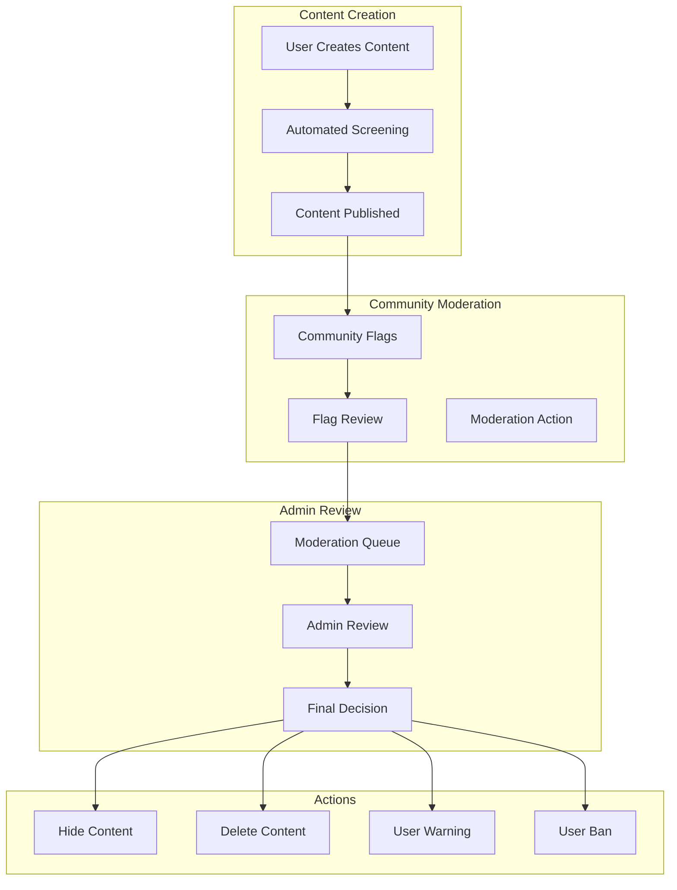

# TexhPulze Content Moderation Guide

This guide outlines the content moderation system, policies, and procedures for TexhPulze.

## 🎯 Overview

TexhPulze implements a comprehensive content moderation system that balances free expression with responsible content management. The system includes automated detection, community flagging, and human review processes.

## 🏗️ Moderation Architecture

### Moderation Pipeline



## 📋 Moderation Policies

### Content Guidelines

#### ✅ Allowed Content

- **Technology News**: Legitimate technology announcements and updates
- **Company Information**: Factual information about technology companies
- **User Opinions**: Constructive criticism and feedback about technology
- **Educational Content**: Explanations of technology concepts
- **Community Discussions**: Civil discourse about technology ethics

#### ❌ Prohibited Content

- **False Information**: Deliberately misleading or false claims
- **Harassment**: Personal attacks, bullying, or intimidation
- **Spam**: Repetitive, irrelevant, or promotional content
- **Illegal Content**: Content that violates laws or regulations
- **Personal Information**: Sharing private information without consent
- **Hate Speech**: Content that promotes hatred or discrimination
- **Violence**: Threats or incitement to violence
- **Copyright Infringement**: Unauthorized use of copyrighted material

### Content Categories

| Category                 | Description                        | Action Threshold |
| ------------------------ | ---------------------------------- | ---------------- |
| **Spam**                 | Repetitive or irrelevant content   | 3 flags          |
| **Harassment**           | Personal attacks or bullying       | 2 flags          |
| **False Information**    | Misleading or false claims         | 3 flags          |
| **Inappropriate**        | Offensive or inappropriate content | 2 flags          |
| **Copyright**            | Copyright infringement             | 1 flag           |
| **Personal Information** | Sharing private information        | 1 flag           |
| **Hate Speech**          | Discriminatory or hateful content  | 1 flag           |
| **Violence**             | Threats or incitement to violence  | 1 flag           |

## 🔧 Technical Implementation

### Flagging System

#### Flag Model

```typescript
interface Flag {
  id: string;
  contentId: string; // Story or Company ID
  contentType: "story" | "company" | "comment";
  reporterId: string;
  reason: FlagReason;
  evidence: string;
  status: "pending" | "reviewed" | "resolved";
  reviewedBy?: string;
  reviewedAt?: Date;
  action?: ModerationAction;
  createdAt: Date;
}
```

#### Flag Reasons

```typescript
enum FlagReason {
  SPAM = "spam",
  HARASSMENT = "harassment",
  FALSE_INFORMATION = "false_information",
  INAPPROPRIATE = "inappropriate",
  COPYRIGHT = "copyright",
  PERSONAL_INFORMATION = "personal_information",
  HATE_SPEECH = "hate_speech",
  VIOLENCE = "violence",
  OTHER = "other",
}
```

### Automated Detection

#### Content Analysis

```typescript
class ContentAnalyzer {
  async analyzeContent(content: string): Promise<ContentAnalysis> {
    const analysis = {
      spamScore: 0,
      toxicityScore: 0,
      falseInfoScore: 0,
      flags: [],
    };

    // Spam detection
    analysis.spamScore = await this.detectSpam(content);

    // Toxicity detection
    analysis.toxicityScore = await this.detectToxicity(content);

    // False information detection
    analysis.falseInfoScore = await this.detectFalseInfo(content);

    // Generate flags
    if (analysis.spamScore > 0.7) {
      analysis.flags.push("spam");
    }
    if (analysis.toxicityScore > 0.8) {
      analysis.flags.push("harassment");
    }
    if (analysis.falseInfoScore > 0.8) {
      analysis.flags.push("false_information");
    }

    return analysis;
  }
}
```

#### Automatic Actions

```typescript
class AutoModerator {
  async processContent(content: Content): Promise<void> {
    const analysis = await this.contentAnalyzer.analyzeContent(content.text);

    if (analysis.flags.length > 0) {
      // Hide content with high risk scores
      if (analysis.spamScore > 0.8 || analysis.toxicityScore > 0.9) {
        await this.hideContent(content.id, "automated_detection");
      }

      // Flag for human review
      await this.flagForReview(content.id, analysis.flags);
    }
  }
}
```

### Community Flagging

#### Flag Submission

```typescript
// API Endpoint: POST /api/stories/:id/flag
async flagContent(req: Request, res: Response) {
  const { contentId, contentType, reason, evidence } = req.body;
  const reporterId = req.user.id;

  // Validate flag
  if (!this.isValidFlagReason(reason)) {
    return res.status(400).json({ error: 'Invalid flag reason' });
  }

  // Check for duplicate flags
  const existingFlag = await this.flagRepository.findOne({
    where: { contentId, reporterId, reason }
  });

  if (existingFlag) {
    return res.status(400).json({ error: 'Already flagged' });
  }

  // Create flag
  const flag = await this.flagRepository.save({
    contentId,
    contentType,
    reporterId,
    reason,
    evidence,
    status: 'pending'
  });

  // Check if content should be hidden automatically
  await this.checkAutoHide(contentId, contentType);

  res.json({ flag });
}
```

#### Auto-Hide Logic

```typescript
async checkAutoHide(contentId: string, contentType: string): Promise<void> {
  const flags = await this.flagRepository.find({
    where: { contentId, contentType, status: 'pending' }
  });

  // Group flags by reason
  const flagCounts = flags.reduce((acc, flag) => {
    acc[flag.reason] = (acc[flag.reason] || 0) + 1;
    return acc;
  }, {});

  // Check thresholds
  for (const [reason, count] of Object.entries(flagCounts)) {
    const threshold = this.getFlagThreshold(reason);
    if (count >= threshold) {
      await this.hideContent(contentId, `auto_hide_${reason}`);
      break;
    }
  }
}
```

## 👥 Admin Moderation

### Moderation Dashboard

#### Queue Management

```typescript
// API Endpoint: GET /api/admin/flags
async getModerationQueue(req: Request, res: Response) {
  const { status, reason, page = 1, limit = 20 } = req.query;

  const query = this.flagRepository.createQueryBuilder('flag')
    .leftJoinAndSelect('flag.content', 'content')
    .leftJoinAndSelect('flag.reporter', 'reporter')
    .orderBy('flag.createdAt', 'DESC');

  if (status) {
    query.andWhere('flag.status = :status', { status });
  }

  if (reason) {
    query.andWhere('flag.reason = :reason', { reason });
  }

  const [flags, total] = await query
    .skip((page - 1) * limit)
    .take(limit)
    .getManyAndCount();

  res.json({ flags, total, page, limit });
}
```

#### Review Process

```typescript
// API Endpoint: POST /api/admin/flags/:id/review
async reviewFlag(req: Request, res: Response) {
  const { id } = req.params;
  const { action, reason, notes } = req.body;
  const adminId = req.user.id;

  const flag = await this.flagRepository.findOne({ where: { id } });
  if (!flag) {
    return res.status(404).json({ error: 'Flag not found' });
  }

  // Update flag status
  flag.status = 'reviewed';
  flag.reviewedBy = adminId;
  flag.reviewedAt = new Date();
  await this.flagRepository.save(flag);

  // Take moderation action
  await this.executeModerationAction(flag.contentId, action, reason, adminId);

  // Log moderation action
  await this.auditLogger.logModerationAction({
    adminId,
    contentId: flag.contentId,
    action,
    reason,
    notes
  });

  res.json({ success: true });
}
```

### Moderation Actions

#### Action Types

```typescript
enum ModerationAction {
  NO_ACTION = "no_action",
  HIDE_CONTENT = "hide_content",
  DELETE_CONTENT = "delete_content",
  WARN_USER = "warn_user",
  SUSPEND_USER = "suspend_user",
  BAN_USER = "ban_user",
  DELETE_USER = "delete_user",
}
```

#### Action Implementation

```typescript
async executeModerationAction(
  contentId: string,
  action: ModerationAction,
  reason: string,
  adminId: string
): Promise<void> {
  switch (action) {
    case ModerationAction.HIDE_CONTENT:
      await this.hideContent(contentId, reason);
      break;

    case ModerationAction.DELETE_CONTENT:
      await this.deleteContent(contentId, reason);
      break;

    case ModerationAction.WARN_USER:
      const content = await this.getContent(contentId);
      await this.warnUser(content.createdBy, reason);
      break;

    case ModerationAction.SUSPEND_USER:
      const content = await this.getContent(contentId);
      await this.suspendUser(content.createdBy, reason, 7); // 7 days
      break;

    case ModerationAction.BAN_USER:
      const content = await this.getContent(contentId);
      await this.banUser(content.createdBy, reason);
      break;
  }
}
```

## 🔒 Privacy & Legal Safeguards

### Data Protection

#### Sensitive Content Handling

```typescript
class PrivacyProtector {
  async protectSensitiveContent(content: Content): Promise<void> {
    // Hide personally identifying information
    if (this.containsPII(content.text)) {
      await this.hideSensitiveFields(content.id);
    }

    // Anonymize user data in flagged content
    if (content.flagged) {
      await this.anonymizeUserData(content.id);
    }
  }

  private containsPII(text: string): boolean {
    const piiPatterns = [
      /\b\d{3}-\d{2}-\d{4}\b/, // SSN
      /\b\d{4}[-\s]?\d{4}[-\s]?\d{4}[-\s]?\d{4}\b/, // Credit card
      /\b[A-Za-z0-9._%+-]+@[A-Za-z0-9.-]+\.[A-Z|a-z]{2,}\b/, // Email
      /\b\d{3}-\d{3}-\d{4}\b/, // Phone
    ];

    return piiPatterns.some((pattern) => pattern.test(text));
  }
}
```

#### Audit Logging

```typescript
class AuditLogger {
  async logModerationAction(action: ModerationActionLog): Promise<void> {
    const logEntry = {
      id: uuidv4(),
      adminId: action.adminId,
      contentId: action.contentId,
      action: action.action,
      reason: action.reason,
      notes: action.notes,
      timestamp: new Date(),
      ipAddress: action.ipAddress,
      userAgent: action.userAgent,
    };

    await this.auditLogRepository.save(logEntry);

    // Send to external audit system if configured
    if (process.env.AUDIT_WEBHOOK_URL) {
      await this.sendAuditWebhook(logEntry);
    }
  }
}
```

### Legal Compliance

#### Content Removal Requests

```typescript
// API Endpoint: POST /api/legal/removal-request
async submitRemovalRequest(req: Request, res: Response) {
  const { contentId, reason, legalBasis, contactInfo } = req.body;

  // Validate legal basis
  if (!this.isValidLegalBasis(legalBasis)) {
    return res.status(400).json({ error: 'Invalid legal basis' });
  }

  // Create removal request
  const request = await this.removalRequestRepository.save({
    contentId,
    reason,
    legalBasis,
    contactInfo,
    status: 'pending',
    submittedAt: new Date()
  });

  // Notify legal team
  await this.notifyLegalTeam(request);

  res.json({ requestId: request.id });
}
```

#### DMCA Compliance

```typescript
class DMCAManager {
  async processDMCARequest(request: DMCARequest): Promise<void> {
    // Validate DMCA request
    if (!this.isValidDMCARequest(request)) {
      throw new Error("Invalid DMCA request");
    }

    // Hide content immediately
    await this.hideContent(request.contentId, "dmca_request");

    // Notify content creator
    await this.notifyContentCreator(request.contentId, request);

    // Log DMCA action
    await this.auditLogger.logDMCAAction(request);
  }
}
```

## 📊 Moderation Analytics

### Metrics Tracking

```typescript
class ModerationMetrics {
  async getModerationStats(timeframe: string): Promise<ModerationStats> {
    const startDate = this.getStartDate(timeframe);

    const [totalFlags, resolvedFlags, pendingFlags, actionCounts, topReasons] =
      await Promise.all([
        this.flagRepository.count({
          where: { createdAt: MoreThan(startDate) },
        }),
        this.flagRepository.count({
          where: { status: "resolved", reviewedAt: MoreThan(startDate) },
        }),
        this.flagRepository.count({
          where: { status: "pending" },
        }),
        this.getActionCounts(startDate),
        this.getTopFlagReasons(startDate),
      ]);

    return {
      totalFlags,
      resolvedFlags,
      pendingFlags,
      resolutionRate: totalFlags > 0 ? resolvedFlags / totalFlags : 0,
      actionCounts,
      topReasons,
      averageResolutionTime: await this.getAverageResolutionTime(startDate),
    };
  }
}
```

### Performance Monitoring

```typescript
class ModerationPerformance {
  async monitorPerformance(): Promise<void> {
    // Check queue backlog
    const pendingCount = await this.flagRepository.count({
      where: { status: "pending" },
    });

    if (pendingCount > 100) {
      await this.alertModerators("High flag backlog", { count: pendingCount });
    }

    // Check resolution time
    const avgResolutionTime = await this.getAverageResolutionTime();
    if (avgResolutionTime > 24 * 60 * 60 * 1000) {
      // 24 hours
      await this.alertModerators("Slow resolution time", {
        avgTime: avgResolutionTime,
      });
    }
  }
}
```

## 🚨 Emergency Procedures

### Crisis Management

#### Mass Flagging

```typescript
class CrisisManager {
  async handleMassFlagging(contentId: string): Promise<void> {
    // Detect mass flagging pattern
    const flagCount = await this.flagRepository.count({
      where: { contentId, createdAt: MoreThan(subHours(new Date(), 1)) },
    });

    if (flagCount > 50) {
      // Auto-hide content
      await this.hideContent(contentId, "mass_flagging");

      // Alert moderation team
      await this.alertModerationTeam("Mass flagging detected", {
        contentId,
        flagCount,
      });

      // Investigate for coordinated attack
      await this.investigateCoordinatedAttack(contentId);
    }
  }
}
```

#### Security Incidents

```typescript
class SecurityIncidentManager {
  async handleSecurityIncident(incident: SecurityIncident): Promise<void> {
    // Immediate response
    if (incident.severity === "critical") {
      await this.emergencyShutdown();
    }

    // Containment
    await this.containIncident(incident);

    // Investigation
    await this.investigateIncident(incident);

    // Recovery
    await this.recoverFromIncident(incident);

    // Reporting
    await this.reportIncident(incident);
  }
}
```

## 📚 Training & Guidelines

### Moderator Training

#### Content Review Guidelines

1. **Context Matters**: Consider the full context of the content
2. **Consistency**: Apply policies consistently across all content
3. **Transparency**: Provide clear reasoning for moderation actions
4. **Appeal Process**: Ensure users can appeal moderation decisions
5. **Cultural Sensitivity**: Be aware of cultural differences and context

#### Decision Framework

```
1. Does the content violate our policies?
   ├─ Yes → Take appropriate action
   └─ No → Allow content

2. Is the content harmful to users?
   ├─ Yes → Hide or delete
   └─ No → Allow content

3. Is the content misleading?
   ├─ Yes → Add fact-checking label
   └─ No → Allow content

4. Is the content spam?
   ├─ Yes → Delete or hide
   └─ No → Allow content
```

### User Education

#### Community Guidelines

- **Be Respectful**: Treat others with respect and civility
- **Be Accurate**: Share accurate information and cite sources
- **Be Constructive**: Provide constructive feedback and criticism
- **Be Transparent**: Disclose conflicts of interest
- **Be Responsible**: Take responsibility for your content

#### Appeal Process

1. **Submit Appeal**: User submits appeal through support system
2. **Review**: Senior moderator reviews the appeal
3. **Decision**: Final decision made within 48 hours
4. **Communication**: User notified of decision and reasoning
5. **Escalation**: Further escalation available if needed

## 🔄 Continuous Improvement

### Policy Updates

- **Regular Review**: Policies reviewed quarterly
- **Community Input**: User feedback incorporated into policy updates
- **Legal Compliance**: Policies updated to reflect legal requirements
- **Best Practices**: Industry best practices incorporated

### System Improvements

- **Automation**: Increase automation for common moderation tasks
- **AI Enhancement**: Improve AI detection capabilities
- **User Experience**: Streamline moderation processes
- **Performance**: Optimize moderation system performance

---

## 📞 Support & Escalation

### Contact Information

- **General Moderation**: moderation@texhpulze.com
- **Legal Issues**: legal@texhpulze.com
- **Emergency**: emergency@texhpulze.com
- **Appeals**: appeals@texhpulze.com

### Escalation Procedures

1. **Level 1**: Community moderators
2. **Level 2**: Senior moderators
3. **Level 3**: Moderation team lead
4. **Level 4**: Legal team
5. **Level 5**: Executive team

---

**This moderation system ensures TexhPulze maintains a safe, respectful, and informative environment for technology discourse while protecting user rights and legal compliance.**
